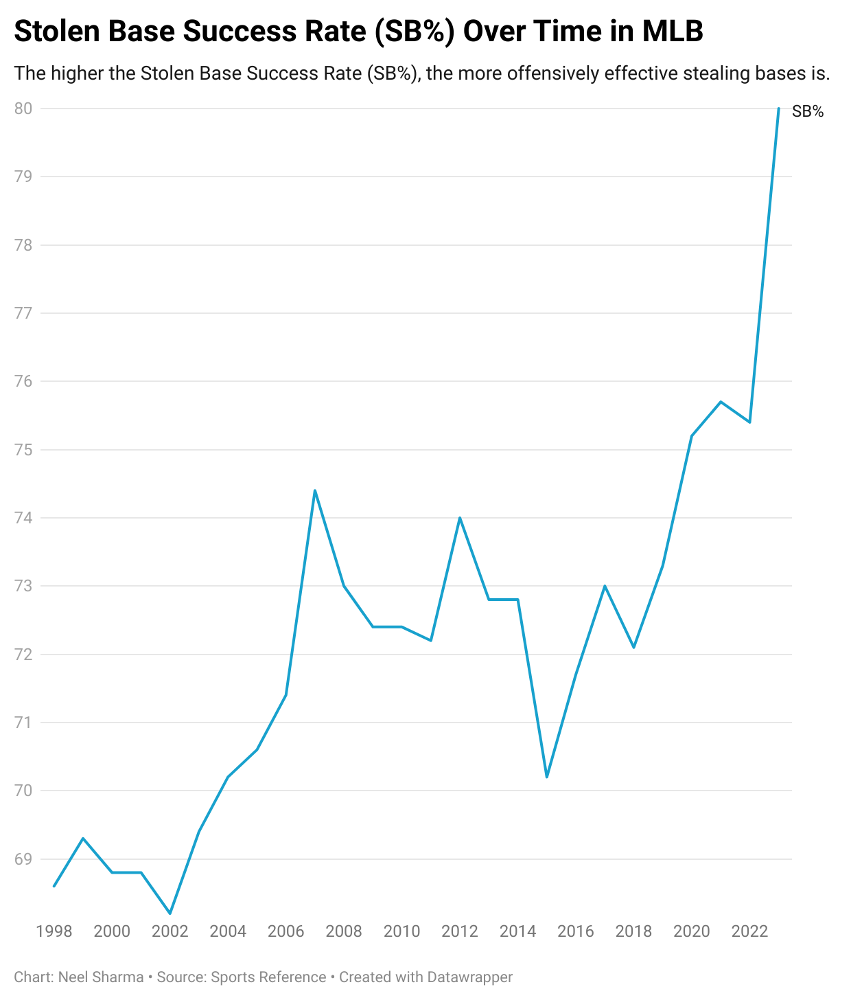
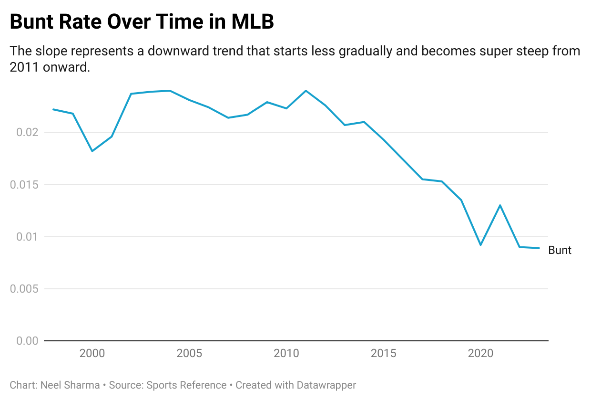
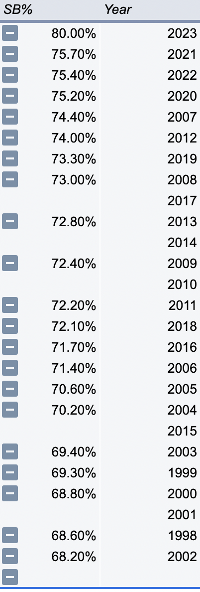
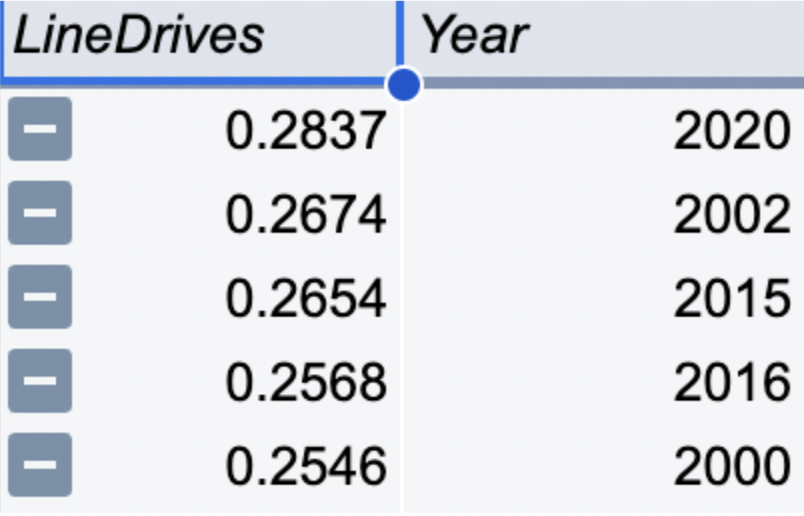
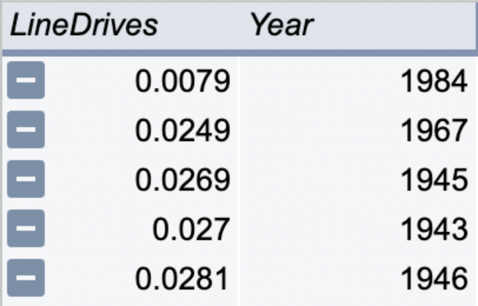
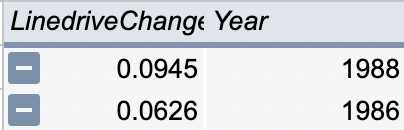

# J124-Final-Project
Data Analysis On Offensive Changes in MLB

# J124 Final Project: Data Analysis and Vizualization of Offensive Style Change in Baseball (MLB) Over Time

By: Neel Sharma

Data Summary:

In summary, my data analysis discovered that the usage of offensive tools like bunts and stolen bases are trending in opposite directions. 

The bunt is a dying method of batting and the usage of stolen bases is becoming more prominent. In addition to this, the usage of the linedrive is on an upwards trend, a sign that the swing of baseball has changed. As visible in the data, a new trend is starting to emerge. The linedrive is now slowly decreasing from its peak and pure contact hitting is a dying sector of baseball. In addition to this, the concept of power/homerun hitting is coming back to baseball as opposed to “small ball” techniques.

As the sport constantly changes, MLB players are also forced to make changes: do they adapt to new play styles or stick to the style that has earned them their roster spots? As the league's style changes, MLB players will also need to have different assets if they want to play. They must be fast and consistently able to bat with power. In order to check both these boxes, the league will have to scout and sign players who are alien to traditional baseball. The MLB will start to lean into players who are much taller and faster than before like Shohei Ohtani and Elly De La Cruz.

Sources:

1. Paul Bien Vice President of San Fransisco Giants Analytics

     [pbien@sfgiants.com](mailto:pbien@sfgiants.com)

 650-823-9642

    As one of the premiere analytics teams in baseball, the San Fransisco Giants’ team is one that is knowledgeable about trends in baseball and revered throughout sports for their dependency on numbers. Bien, who is the VP and head of this sector, is someone who is useful for this topic.

2. Jeff Passan: ESPN baseball analyst

    [ jeff.passan@espn.com](mailto:jeff.passan@espn.com)

816-808-2539

    As an analyst at ESPN, Passan is knowledgable on how these trends happen and what cause them. He is a credible source who is known for understanding the dynamics of baseball extremely well.

Additional Sources:

	

1. [https://www.pitcherlist.com/touching-base-whos-stealing-more-with-the-new-rules/#:~:text=Not%20only%20have%20stolen%20bases,about%20when%20to%20steal%20bases](https://www.pitcherlist.com/touching-base-whos-stealing-more-with-the-new-rules/#:~:text=Not%20only%20have%20stolen%20bases,about%20when%20to%20steal%20bases).

    This article touches on the development of the stolen base in recent years, and also speaks of the trend touched on in this data analysis. This source is a well known baseball site that is credible for its thorough breakdown and analysis of events in the MLB.

2. [https://sites.northwestern.edu/nusportsanalytics/2021/04/02/is-the-bunt-dying/](https://sites.northwestern.edu/nusportsanalytics/2021/04/02/is-the-bunt-dying/)

    The Northwestern Sports Analytics Group is a credible source who, in this article, discuss the lowered use of the bunt. This article touches on the concepts mentioned before in this data, and explains in depth other parts of the trend.

Data Visualization:

1.The following line chart is of stolen base percentage among MLB players over the last 25 years.

(https://datawrapper.dwcdn.net/jQfAV/1/)

2. The following line chart is of the bunt rate of MLB players along a 25 year time period.

(https://datawrapper.dwcdn.net/ty1WR/1/)

Data Analysis Process:

	

1. What are the highest and lowest stolen base percentages? Compare the percentages and calculate the percent increase or decrease between them.

    80.00% is the highest stolen base percentage and 68.20% is the lowest. There is a 17% percent change going from 68.20SB% to 80.00SB%. (%change of SB%)

1. After creating a new pivot table in the spreadsheet, add two rows to the pivot table. 
2. One being the row for SB% (stolen base percentage) and the other being the year so that we can identify if the percentage change is an increase or decrease over time. 
3. Now, copy and paste the highest and lowest SB%’s pivot table rows into the spreadsheet and use the equation (New-Old)/Old to find this value. 

2. How has the rate of the “bunt” hit changed from 1998 to 2023? Which year has the highest bunt rate?

    The rate has slowly decreased and overall, its usage has gone down 59.91% from 1998 to 2023.

1. Use a VLOOKUP formula in order to match the years 2023-1998 from the base running sheet with the Bunt rate found in the hitlocation sheet.
2. Now create a pivot table with year and bunt as rows. 
3. Now, sort the pivot table ascending and descending in order to get the highest and lowest bunt rates. 
4. Take the highest and lowest values respectively and copy paste them into a spreadsheet. 
5. Use the percent change formula to calculate the bunt rate’s change.
3. Which year had the highest jump in stolen base success percentage in comparison to the year before?

	2023 had the largest jump in SB% by a margin of 1.60% and an increase of 4.60% from the previous year.

1. First take all SB% data and a apply and create a new value that represents its increase from the previous year. 
2. Now make a pivot table and rank these percentage gain/losses in descending order. 
3. Now record the data you need.
4. Which five years from 1914 to 2023 have the highest line drive rates? The lowest? 

    Years which had the highest linedrive rates were 2020, 2002, 2015, 2016, and 2000. The lowest years were 1984, 1967, 1945, 1943, and 1946.

1. Create a pivot table with all of the line drive data shown in the hitlocations sheet and set the rows as years and linedrives.
2. Now sort them in ascending and descending order and take data needed.
5. Which two years have seen the highest increase in linedrive rates from the year previous to them?

The two years in which the rate of linedrives increased the most was 1988 and 1986.

1. Create an equation that represents the increase/decrease the linedrive of a particular year had in comparison to the previous year and label it as a new variable.
2. Now create a pivot chart and sort these values in a descending order so the highest values appear at the top of the table.
3. Record data needed.
